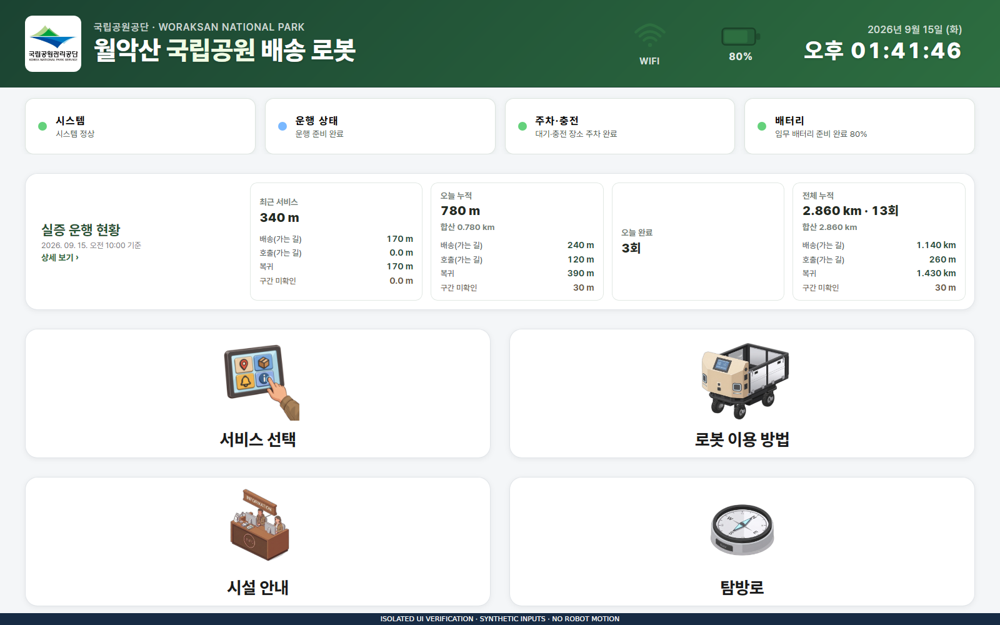
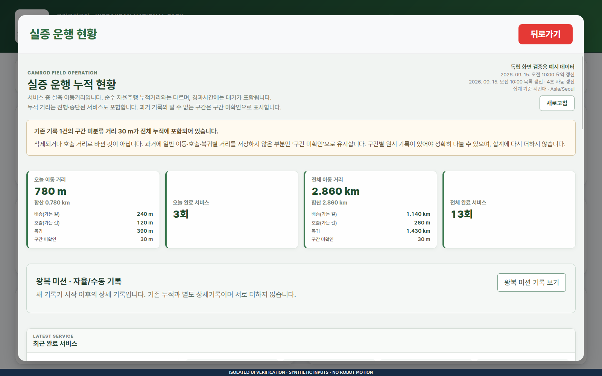
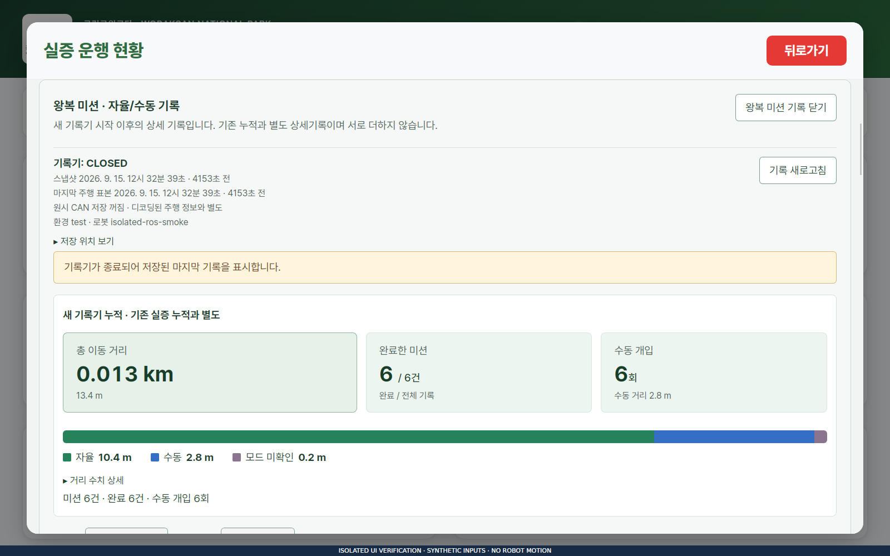
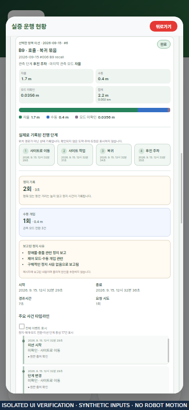

# 2026-09-15 실증 테스트 준비 — v2.2.8

## 소스와 장비

현재 `develop`과 원격에서 받은 `v2.2.8` 태그의 기준 커밋은
`b91981d552ab7ac47aa1177b341df6f8b379a223`이다. 그 위에 이번 로컬 검증에서
확인한 UI·실행 스크립트·검사·문서 정리 수정이 적용되어 있다.
장비는 Jetson `aarch64`, Ubuntu 22.04.5, ROS 2 Humble이다.

아래 결과는 이 장비에서 실행했다. [기존 릴리스 제작 기록](../../../camrod_ui/docs/release_v2_2_8_validation.md)의
다른 PC 결과와 합산하지 않는다. 전체 원본은
`/home/nvidia/camrod_ws/validation/v2.2.8-20260915/`에 보존한다.

## 완료한 검사

| 범위 | 결과 | 원본 위치 |
| --- | --- | --- |
| 전체 workspace 빌드 | 발견한 65개 패키지 모두 성공. 기존 build/install을 사용하는 전체 증분 빌드 | `build/full-build.log` |
| 등록된 기능 CTest | 77개 타깃 최종 통과. 최초 실패한 2개는 수정 후 재실행 통과 | `tests/functional-final.json` |
| CTest 미등록 Python | 7개 파일의 72개 검사 통과 | `tests/functional-final.json` |
| 설치 바이너리·공유 라이브러리 | ELF 88개에서 찾지 못한 동적 의존성 0개 | `build/runtime-link-check.json` |
| React 테스트 | 61 통과 | `ui/jest.log` |
| 실제 WebKit 화면 | 1600×1000·390×844·1920×1080의 12개 화면 검사 통과. 카드·거리 숫자 넘침 0 | `ui/webkit-report.json` |
| 로컬 UI Python | 866 통과, 사용자 보유 WAV 해시 계약 14 실패 | `ui/ui-pytest.log` |
| 별도 태그 원본의 음성 계약 | 130 통과 | `voice/release-voice.log` |
| 실제 ROS 미션 기록 노드 | B7/B8/B9 × 배송/호출 왕복 6건 완료 | `ui/ros-smoke/result.json` |
| 설치본 Robot/Guest/API/기록기 | 격리 domain 192에서 실제 HTTP·API 연결과 합성 상태 5종 확인, 7개 상태 조건 통과 | `ui/live-api/result.json`, `ui/live-api/state-checks.json` |
| 유지보수 셸 12개 | 실행 권한·`bash -n` 모두 정상, 바이트 중복 0개. ShellCheck 오류 0개 | `scripts/inventory-final.json`, `scripts/shellcheck-final.json` |
| 셸·경로·프런트엔드 동기화 검사 | 42 통과. 작업 디렉터리·공백 포함 경로·출력 폴더·Docker 인자 전달 포함 | `scripts/pytest-final.log` |

사용자가 원래 수정해 두었던 `site_B1`~`site_B13`, `to_campsite` 음성은 모두
보존했다. 14개 실패는 파일이 태그의 고정 해시와 다르다는 검사 결과이며,
파일 변경으로 억지로 통과시키지 않았다. 각 WAV는 PCM으로 읽을 수 있었고,
작업 전후 동일 해시 여부를 `voice/local-audio-preservation.json`에 기록했다.
별도 태그 원본의 통과가 로컬 14개 실패를 지우지는 않는다.

준비 완료, 배터리 34%, EStop, 위치 추정 상실, 장애 해제 상태를 실제 설치본
백엔드에 입력했다. EStop의 준비 차단, 위치 추정 상태 보고, 장애 해제 후 준비
회복과 전 시나리오의 주행 비활성을 확인했다. 운영 DB의 검사 전후 SHA-256은
같았다. 이 테스트는 물리 로봇을 움직이지 않았다.

검사 범위가 겹치므로 표의 개수를 고유 기능 수로 합산하지 않는다. 전체 린트는
실행하지 않았으며, 소스별 결과와 로그 해시는 [검증 요약 JSON](validation-summary.json)에 있다.

## 문서·사진 정리

- 동일 내용인 Markdown 문서는 발견하지 않았다. 버전별 고유 릴리스 이력과 실험 기록은 유지했다.
- 완전히 같은 PNG 2개/GIF 1개의 중복 사본을 정리해 283,726바이트를 줄였다. 모든 사용처를 원본 경로로 바꾸고 관련 SHA manifest와 생성기·검사를 맞췄다.
- [삭제 경로 → 보존 경로와 SHA-256](media-cleanup.json)을 기록했다. 원본 파일의 내용은 변경하지 않았다.
- Robot/Guest 로고는 별도 정적 서버 배포에 각각 필요한 자산이므로 유지했다.
- 존재하지 않던 실험 링크 2개를 올바른 자료 위치로 고쳤다. 템플릿의 패키지 경로 예시는 복사 후 바꾸는 자리로 구분했다.
- 과거 map-v22 그림은 기존 지도 원본으로 재생성 검증한다. 현재 지도는 채택된 map-v27/v1.0.18 snapshot과 정확히 일치하는지 검사하며, 서로 다른 지도 증빙을 사용하는 경우 계속 거부한다.
- [Docker 안내](../../../docker/README.md)는 실제 존재하는 파일과 미검증 이미지 범위를 명시하도록 고쳤다.

원본 정리 후 기존 래스터 이미지 149개를 모두 읽을 수 있었고, 기존 SHA manifest
56개 항목도 일치했다. 새 보고서 연결까지 Markdown 121개에서 로컬 링크 593개를
확인했으며 끊어진 실제 자료 링크는 0개였다. 패키지에 복사해서 사용하는 템플릿의
예시 경로 5개는 별도로 기록했다.

## 실제 WebKit 화면

Jetson에서 production React bundle을 실제 WebKitGTK로 열었다. 대기 카드의
아이콘·라벨 공간과 실증 현황의 거리 숫자가 카드 밖으로 넘치던 CSS를 수정했다.
최종 설치 CSS는 `main.39a20c5d.css`이며, UI 재빌드와 관련 계약 검사 41개도 통과했다.
화면의 기존 누적 수치는 검증용 입력이고, 새 미션 상세는 격리 ROS 기록 노드가
합성 입력으로 저장한 결과다. 실차 운행 실적으로 사용하지 않는다.

| 대기 화면 · 1600×1000 | 기존 실증 누적 · 1600×1000 |
| --- | --- |
|  |  |

| 새 미션 기록 · 1600×1000 | 미션 상세 · 390×844 |
| --- | --- |
|  |  |

전체 파일 무결성은 [SHA256SUMS](SHA256SUMS)로 확인한다.

## 재현 범위

저장소 루트의 `./colcon_build.sh`가 기본 빌드 진입점이다. 정적 가이드 생성은
Pillow 9.0의 기존 상수와 새로운 enum 표현을 모두 지원하도록 수정했다.
별도의 검증 JSON, 로그와 캡처를 실제 주행 자료로 오인하지 않도록 입력 종류를 표시한다.

이번 기록은 브라우저 표시, 코드·설정 계약, 합성 ROS 입력에서의 기록 동작에 대한
검증이다. 실차 B1–B13 주행·실제 CAN 수신·물리 센서·충전·음성 출력·Docker 이미지의
현장 완료 판정을 의미하지 않는다.
